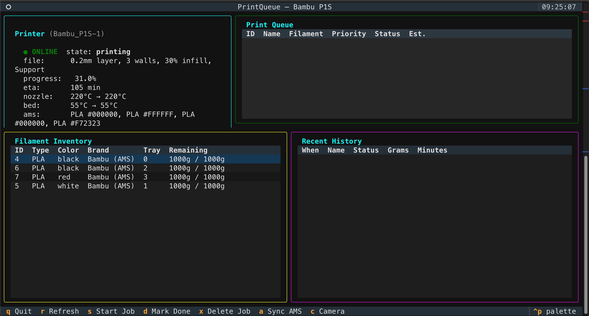

# PrintQueue

A terminal-based 3D print queue manager for the **Bambu Lab P1S** (Cloud mode).

- 🖨️ Live printer status via **Bambu Cloud MQTT** (REST for login/device list, MQTT for telemetry)
- 📋 SQLite-backed print queue with priorities
- 🧵 Filament inventory tracking (spool-level grams remaining) + AMS tray readback
- 📊 Print history log with optional CSV export
- 🎛️ Textual TUI dashboard **and** full CLI
- 🌐 Works fully offline — if the cloud is unreachable or not configured, queue management still runs



---

## Install

```bash
cd ~/Projects/printqueue
python3 -m venv .venv && source .venv/bin/activate
pip install -r requirements.txt

# Use the launcher directly:
./pq --help

# ...or install as an entrypoint:
pip install -e .
pq --help
```

Requires **Python 3.9+**. Dependencies: `textual`, `bambu-lab-cloud-api`
(the last one is AGPL-3.0 and pulls in `paho-mqtt`, `requests`, plus `flask`/`opencv-python`
for features we don't use). SQLite is stdlib. `./pq` automatically re-execs into
`.venv/bin/python3` when the venv exists, so it works without activating.

The database lives at `~/.printqueue/printqueue.db` and is created on first run.
Config (Bambu Cloud token + uid + device id) lives at `~/.printqueue/config.json` (mode `0600`).
When the database file is created for the first time, James's default filament spools
(PLA black, red, blue — Bambu, 1kg each) are seeded automatically.

---

## Quick Start

```bash
# 1. Login to Bambu Cloud (interactive — email + password + verification code)
./pq login

# 2. List printers on your account, pick the device id you want to target
./pq devices
./pq config --device <DEVICE_ID>   # optional; defaults to first device

# See what filament's on hand
./pq inventory

# Add a job
./pq add "Benchy v2" ~/Downloads/benchy.stl --filament PLA --priority high --minutes 45 --grams 15

# List the queue
./pq list

# Check printer
./pq status

# Launch the TUI dashboard
./pq dashboard
```

**No token yet? No problem.** The app still runs — the printer panel just shows `● API NOT CONFIGURED` and every other feature works normally.

---

## CLI Reference

| Command | Description |
| --- | --- |
| `pq add <name> [stl] [--filament PLA] [--priority high] [--minutes N] [--grams N] [--notes ...]` | Add a job |
| `pq list [--status queued\|printing\|done\|failed]` | List jobs |
| `pq start <job_id>` | Mark job as printing |
| `pq done <job_id> [--failed] [--grams N] [--minutes N]` | Complete (or fail) a job — deducts filament |
| `pq remove <job_id>` | Delete a job |
| `pq priority <job_id> <high\|medium\|low>` | Change priority |
| `pq inventory` | List spools (with AMS tray assignments) |
| `pq inventory sync` | Pull loaded spools from the AMS (type/color/tray, plus fill %% on RFID spools) |
| `pq inventory add --type PLA --color black --brand Bambu --grams 1000` | Add a spool |
| `pq inventory use <filament_id> <grams>` | Manually deduct grams |
| `pq inventory set <filament_id> <grams>` | Set remaining grams (absolute — e.g. after weighing) |
| `pq inventory remove <filament_id>` | Remove a spool |
| `pq status` | One-shot printer poll (Bambu Cloud) |
| `pq camera [-o out.jpg]` | Save a chamber-camera snapshot (LAN, 1280x720) |
| `pq history [--limit N] [--csv]` | Recent prints (CSV export supported) |
| `pq dashboard` | Launch the Textual TUI |
| `pq login [--region global|china]` | Interactive Bambu Cloud login (saves token) |
| `pq config [--token T] [--device D] [--base URL] [--clear] [--show]` | Manage Bambu Cloud config |
| `pq devices` | List printers on your Bambu account |
| `pq seed [--force]` | Re-seed default filament |

Global: `--db PATH` to override the SQLite location.

---

## TUI Dashboard

`./pq dashboard` opens a four-panel view:

```
┌──────────────────────┬──────────────────────────────────┐
│  Printer (10.0.0.9)  │  Print Queue                      │
│  ● ONLINE            │  ID  Name        Filament  Prio   │
│  progress: 42.1%     │  1   Benchy      PLA       HIGH   │
│  nozzle: 210→210°C   │  2   Cable clip  PETG      MED    │
├──────────────────────┼──────────────────────────────────┤
│  Filament Inventory  │  Recent History                   │
│  PLA black  912g     │  07-12 22:14  Benchy  ✅ done     │
│  PLA red    1000g    │  07-11 09:03  Bracket ❌ failed   │
└──────────────────────┴──────────────────────────────────┘
```

Keys: `q` quit · `r` refresh · `s` start job · `d` mark done · `x` twice to delete (confirmation) · `a` sync AMS → inventory · `c` toggle live camera · arrows to navigate.

### AMS inventory sync

`pq inventory sync` (or `a` in the TUI) reconciles inventory with what's physically
loaded: it matches loaded trays to existing spools by type + color (creating spools it
has never seen, including duplicates like two black PLAs), records each spool's tray,
and clears tray assignments on unloaded shelf spools without touching their grams.
**Fill percentage is only reported for Bambu RFID-tagged spools** (`remain: -1` +
zeroed `tag_uid` = third-party spool); untagged spools are assumed full on first sync
and tracked downward by job deductions — correct anytime with `pq inventory set`.

The printer panel refreshes every 5 seconds from a persistent MQTT subscription (updates
arrive pushed, not polled). Queue/inventory/history tables also auto-refresh every 15s.
If the P1S is off or unreachable, the panel shows **● OFFLINE** and the rest of the app
keeps working normally. Times are displayed in your local timezone (stored as UTC).

---

## Data Model

- **`filament`** — `id, type, color, brand, grams_remaining, grams_initial, notes, added_at`
- **`jobs`** — `id, name, stl_path, filament_type, filament_id → filament(id), estimated_minutes, estimated_grams, priority, status, added_at, started_at, finished_at, notes`
- **`history`** — `id, job_id → jobs(id), job_name, filament_type, grams_used, minutes_taken, status, finished_at, notes`

Foreign keys are enforced (`PRAGMA foreign_keys = ON`). Deleting a spool or job nulls the reference in dependent rows rather than cascading.

---

## Bambu Lab Notes

James's P1S runs in **Cloud mode** (LAN-only disabled). There is **no official public
Bambu Cloud API** — this app uses the community-documented (reverse-engineered) surface
via the [`bambu-lab-cloud-api`](https://github.com/coelacant1/Bambu-Lab-Cloud-API) library:

1. **REST** `GET /v1/iot-service/api/user/bind` — list printers bound to the account
   (also provides a coarse online/print_status fallback).
2. **MQTT** `us.mqtt.bambulab.com:8883` (TLS) — live telemetry. Username `u_{uid}`,
   password = access token, topic `device/{serial}/report`. A `pushall` request is sent
   on connect because P1-series printers otherwise only push deltas.

There is no REST endpoint for live telemetry (temperatures/progress) — MQTT is the only
source. `pq status` does a one-shot connect → pushall → report → disconnect; the TUI keeps
a persistent subscription and renders from the latest merged report.

### Authentication

**Bambu Lab does NOT expose a static API token on their website.** Authentication uses
their cloud login flow (email + password, then an emailed verification code or MFA):

```bash
# Interactive login — prompts for email, password, and verification code
pq login
```

The token (~3 months validity) and your account `uid` (needed as the MQTT username) are
stored in `~/.printqueue/config.json` (mode `0600`).

**Manual token entry** (e.g., extracted via browser dev tools) still works, but MQTT also
needs your uid; `pq status` resolves and caches it automatically on first use:

```bash
pq config --token <TOKEN>
```

**Caveats:** This is an unofficial/reverse-engineered API. Bambu Lab has tightened
third-party access before (January 2025 "Authorization Control") and can again — note
that read-only telemetry is unaffected by command signing requirements, and this app
never sends control commands. The app degrades gracefully — queue and inventory
management work fully offline regardless. Only the **global** region broker is wired up
(`--region china` login works, but MQTT telemetry assumes the US broker).

### Failure modes (all handled gracefully)

| Situation | What you see | App still usable? |
| --- | --- | --- |
| No token set | `● API NOT CONFIGURED` | ✅ yes — queue/inventory work |
| `bambu-lab-cloud-api` not installed | `● OFFLINE — cloud library missing` | ✅ yes |
| Bambu Cloud down / no network | `● OFFLINE — <error>` | ✅ yes |
| Token wrong / expired | `● OFFLINE — token rejected, run pq login` | ✅ yes |
| No printers on account | `● OFFLINE — No printers found` | ✅ yes |
| MQTT blocked but REST reachable | `● ONLINE [cloud-rest]` (coarse status only) | ✅ yes |

### Chamber camera

P1/A1-series printers serve 1280x720 JPEG frames over TLS on **local port 6000**
(this part is LAN, not cloud — the machine running `pq` must be able to reach the
printer's IP, and "LAN Mode Liveview" must be enabled on the printer). Setup is
automatic: the access code comes from the cloud device record, and the printer's LAN
IP is read from its own MQTT telemetry (`net.info[].ip`), which works even when the
printer sits on a different subnet/VLAN — SSDP discovery is the fallback. Both are
cached in config. `pq camera` saves a snapshot; `c` in the TUI toggles a live panel
(~0.5-1 fps). Frames render as **true bitmaps** on terminals with Sixel or the Kitty
graphics protocol (iTerm2, kitty, WezTerm) and fall back to Unicode half-blocks
elsewhere — the renderer is auto-detected at startup. The TLS connection to the
printer does not verify its self-signed certificate (inherent to the device;
traffic never leaves your LAN).

### LAN fallback

A `lan_host` config field stores the printer's LAN IP (used by the camera; auto-
discovered). Printer *telemetry* still always uses the cloud — full LAN MQTT support
(Developer Mode) is left as a future enhancement.

---

## Tests

```bash
.venv/bin/python -m pytest tests/ -q
```

---

## Files

```
printqueue/
├── pq                      # executable launcher
├── pyproject.toml
├── requirements.txt
├── README.md
├── tests/                  # pytest suite (db layer + telemetry parser)
└── printqueue/
    ├── __init__.py
    ├── api.py              # Bambu cloud client (REST identity + MQTT telemetry)
    ├── auth.py             # Interactive login (email code / MFA) + token validation
    ├── cli.py              # argparse CLI
    ├── config.py           # ~/.printqueue/config.json manager
    ├── db.py               # SQLite layer
    └── ui.py               # Textual TUI
```

---

## Acknowledgments

The cloud layer stands on the shoulders of the community that reverse-engineered
Bambu's API:

- **[coelacant1/Bambu-Lab-Cloud-API](https://github.com/coelacant1/Bambu-Lab-Cloud-API)**
  (`bambu-lab-cloud-api` on PyPI, AGPL-3.0) — the library this app uses for
  authentication, device listing, and cloud MQTT telemetry.
- **[Doridian/OpenBambuAPI](https://github.com/Doridian/OpenBambuAPI)** — the
  community documentation of the cloud HTTP and MQTT protocols.

This project is not affiliated with or endorsed by Bambu Lab.

## License

MIT — free to copy, modify, and use (including commercially). If you build on
this project, please keep the copyright notice (per the license) and a link
back to this repository. See [LICENSE](LICENSE).

Note: the `bambu-lab-cloud-api` dependency is AGPL-3.0; if you distribute a
combined/derived work, review that license's terms as well.
